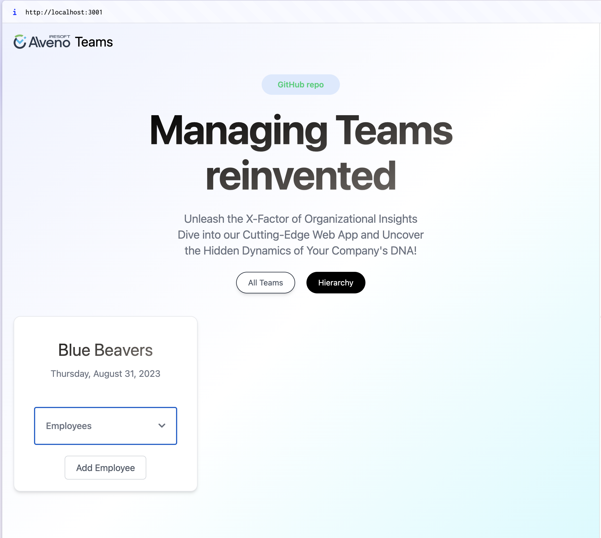

This is a [Next.js](https://nextjs.org/) project bootstrapped with [`create-next-app`](https://github.com/vercel/next.js/tree/canary/packages/create-next-app).

## Task

Create an application that displays data about Teams and their employees.

* Implement using the React library. Feel free to use other libraries or frameworks using React.
* Design an eye-pleasing visual, including a mobile responsive display.
* Way of styling or choosing a library of components of your own choice.
* Show/hide team content
* Employees who no longer work - should be displayed differently
* Display the employee's name and position
* Design and implement the method of adding employees to the team.

Optional tasks(not included in this repo):

* Design and implement the addition of teams.
* Design and implement employee editing.
* Design and implement teams editing.
* Support for subteams nesting

Total time spent on the project: 23h (approx 3working days)

## Timeline

v0.1
- (1h) find nice nextjs template [x]
- (20h) complete main task parts [x]
- (2h) create own supabase BE [x]

to be done:

v0.1.1
- use optimistic update for updating employee due to missing option in next js app router cashing: https://youtu.be/7BgzXp35ZuU?si=eyqtvGZKeM01yi2x

v0.2 
- add first 3 optional tasks


## App



## Setup

Inside this directory run:

```bash
npm i
npm run dev
```

Open [http://localhost:3000](http://localhost:3000) with your browser to see the result.

## Technologies used

* tailwindCSS
* nextjs
* Zod
* react-hook-form
* radix-ui
